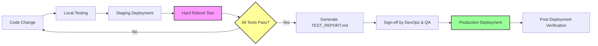

# Production Service Documentation Standards
# 生產服務文件標準

## Mandatory Framework for All Managed Services
## 所有託管服務的強制性框架

---

> **⚠️ CRITICAL NOTICE 關鍵聲明**
>
> **This documentation framework is mandatory for ALL managed services.**  
> **此文件框架對所有託管服務為強制性的。**
>
> **These standards apply to:**
> - ✅ Jasslin internal engineering teams  
> - ✅ Third-party vendors and contractors  
> - ✅ All production and staging environments  
>
> **這些標準適用於：**
> - ✅ Jasslin 內部工程團隊
> - ✅ 第三方廠商和承包商
> - ✅ 所有生產和預發環境
>
> **No one is exempt. Non-compliance will result in deployment rejection and contract review.**  
> **無人豁免。不合規將導致部署被拒絕及合約審查。**

---

## Table of Contents (目錄)

1. [The Incident: Why This Framework Exists](#the-incident-why-this-framework-exists)
2. [Framework Purpose](#framework-purpose)
3. [Core Standards](#core-standards)
4. [Definition of Done](#definition-of-done)
5. [Documentation Structure](#documentation-structure)
6. [Enforcement & Compliance](#enforcement-and-compliance)
7. [Authorization](#authorization)

---

## The Incident: Why This Framework Exists
## 事故背景：為何需要此框架

### THE INCIDENT (事故)

**Date**: January 2026  
**日期**：2026年1月

**Classification**: Critical Service Outage — Complete System Failure  
**分類**：關鍵服務中斷 — 系統完全故障

**Total Downtime**: **TWO WEEKS** of complete service unavailability  
**總停機時間**：**兩週**的完全服務不可用

---

### What Happened (發生了什麼)

A routine server reboot was performed on a production system hosting the **Flemabus** service for a mission-critical client.  
對託管 **Flemabus** 服務的生產伺服器執行例行性重啟，該系統為關鍵客戶部署。

**The server came back online. The services did not.**  
**伺服器重新上線了。但服務沒有。**

Multiple engineers investigated, they found:  
多名工程師調查時發現：

```bash
docker ps
# Result: Empty. No containers running.
# 結果：空白。沒有容器在運行。

systemctl status docker.service
# Output: inactive (dead)
# 輸出：不活躍（已停止）
```

**But they could not solve the problem.**  
**但他們無法解決問題。**

Days passed. Engineers attempted various recovery approaches. All failed. The system configuration was undocumented. Environment variables were unknown. The architecture existed only in scattered chat logs and vendor memory.  
數天過去了。工程師嘗試了各種恢復方法。全部失敗。系統配置未記錄。環境變數未知。架構僅存在於零散的聊天記錄和廠商記憶中。

**It was not until a specific engineer (Ezra Wu) was consulted that the problem could be diagnosed and resolved.**  
**直到諮詢特定工程師（吳子郇）後，問題才得以診斷和解決。**

This exposed a **critical single point of failure**: **Critical system knowledge existed only in one person's memory.**  
這暴露了一個**關鍵單點故障**：**關鍵系統知識僅存在於一個人的記憶中。**

**The recovery process took TWO WEEKS** — not because of technical complexity, but because of **complete absence of documentation**.  
**恢復過程耗時兩週** — 不是因為技術複雜性，而是因為**完全缺乏文件記錄**。

**Two weeks of zero service availability. Two weeks of client business interruption. Two weeks of reputational damage.**  
**兩週的零服務可用性。兩週的客戶業務中斷。兩週的聲譽損害。**

---

### Root Cause Analysis (根本原因分析)

The Post-Mortem investigation revealed **two critical failures** that should not exist in a production environment:  
事後檢討調查揭露了**兩個關鍵失誤**，這些失誤在生產環境中不應該存在：

#### Failure #1: Service Persistence Failure (服務持久性失敗)

**Finding**: The Docker daemon was not configured as a system-level service to auto-start on boot.  
**發現**：Docker 守護程式未配置為系統級服務以在開機時自動啟動。

```bash
systemctl is-enabled docker.service
# Expected: enabled ✅
# Actual: disabled ❌
```

**What this means**: After any reboot (routine, crash, power failure), the Docker daemon would remain offline until manually started.  
**這意味著什麼**：在任何重啟（例行性、崩潰、電源故障）後，Docker 守護程式將保持離線狀態，直到手動啟動。

**Professional Standard**: System-critical services MUST be enabled for automatic startup. This is a fundamental industry standard for system administrators.  
**專業標準**：系統關鍵服務必須啟用自動啟動。這是系統管理員的基本業界標準。

**How this was missed**: The deployment vendor either:  
**如何遺漏**：部署廠商要麼：
- Was not aware this was required  
  未察覺此為必需
- Knew but deliberately skipped it (negligence)  
  知道但故意跳過（疏忽）
- Assumed "someone else" would do it (systemic failure)  
  假設「其他人」會做（系統性失敗）

#### Failure #2: Self-Healing Failure (自我恢復失敗)

**Finding**: The `docker-compose.yml` configuration lacked `restart: always` policies on all services.  
**發現**：`docker-compose.yml` 配置在所有服務上缺少 `restart: always` 策略。

```yaml
# What was deployed (部署的內容):
services:
  api-service:
    image: flemabus-api:latest
    # restart: always ❌ MISSING

# What should have been deployed (應該部署的內容):
services:
  api-service:
    image: flemabus-api:latest
    restart: always  # ✅ MANDATORY
```

**What this means**: Even if Docker had been running after the reboot, containers would NOT have restarted automatically. Manual intervention would still have been required.  
**這意味著什麼**：即使 Docker 在重啟後運行，容器也不會自動重啟。仍然需要人工介入。

**Professional Standard**: All production services must be self-healing. **Systems must survive failures without human intervention.**  
**專業標準**：所有生產服務必須具備自我恢復能力。**系統必須在無人為介入的情況下經得起故障。**

**How this was missed**: The deployment relied on "manual memory" — the expectation that someone would remember to run `docker-compose up` after every reboot. This is **unacceptable** in professional engineering.  
**如何遺漏**：部署依賴於「手動記憶」— 期望有人會記得在每次重啟後運行 `docker-compose up`。這在專業工程中是**不可接受的**。

---

### The Compounding Factors (複合因素)

Beyond the two primary failures, the incident exposed systemic weaknesses:  
除了兩個主要失誤外，該事故還暴露了系統性弱點：

#### No Documentation (無文件記錄)

There was **no written deployment guide**. The "knowledge" of how to deploy and maintain the system existed only in:  
**沒有書面部署指南**。如何部署和維護系統的「知識」僅存在於：

- The vendor's memory (廠商記憶)
- Undocumented chat messages (未記錄的聊天訊息)  
- Assumptions and tribal knowledge (假設和部落知識)
- **One specific engineer's personal memory (特定工程師的個人記憶)**

**This created a critical single point of failure: Only ONE person could recover the system.**  
**這造成了關鍵單點故障：只有一個人能夠恢復系統。**

When multiple engineers attempted recovery and failed, the client suffered **continuous downtime** until that specific engineer could be reached. **This is unacceptable.**  
當多名工程師嘗試恢復但失敗時，客戶遭受**持續停機**，直到該特定工程師可以聯繫上。**這是不可接受的。**

**The result: It took TWO WEEKS to reconstruct the system from scratch.**  
**結果：從零開始重建系統花了兩週時間。**

Engineers had to reverse-engineer the entire configuration, guess at environment variables, and piece together the architecture through trial and error — because **no documentation existed**.  
工程師必須對整個配置進行逆向工程，猜測環境變數，並透過試錯法拼湊架構 — 因為**沒有文件記錄存在**。

#### No Staging Verification (無預發環境驗證)

The system was deployed directly to production **without any resilience testing**. Specifically:  
系統直接部署到生產環境，**未經任何韌性測試**。具體而言：

- ❌ No hard reboot test was performed  
  ❌ 未執行硬重啟測試

- ❌ No automated recovery verification  
  ❌ 無自動恢復驗證

- ❌ No acceptance criteria checklist  
  ❌ 無驗收標準檢查清單

**The first time the system's resilience was tested was during a production reboot. It failed. The client suffered TWO WEEKS of downtime.**  
**系統韌性首次測試是在生產環境重啟期間。它失敗了。客戶遭受了兩週的停機時間。**

This represents a serious process failure.  
這代表嚴重的流程失誤。

#### No Accountability (無問責制)

There was no formal handover document. No sign-off process. No verification checklist.  
沒有正式的交接文件。沒有簽核流程。沒有驗證檢查清單。

The vendor said "it's deployed" and we accepted it **without verification**.  
廠商說「已部署」，我們**未經驗證就接受了**。

---

### Business Impact (業務影響)

| Impact Category | Details |
|-----------------|---------|
| **Service Downtime** | **TWO WEEKS** of complete service unavailability |
| **Single Point of Failure** | **Multiple engineers could not resolve the issue**; only one specific engineer possessed the knowledge to recover the system; critical knowledge centralization risk |
| **Client Business Impact** | **14 days** of Flemabus service operations completely halted; client unable to serve their end customers; massive revenue loss for client |
| **Financial Loss** | Major SLA breach penalties; contract termination risk; potential legal action |
| **Reputation Damage** | Significant damage to client trust; Jasslin's technical competence questioned at executive level; client considering competitor migration |
| **Emergency Response Cost** | Multiple senior engineers diverted for **2 weeks**; all other projects delayed; specific engineer had to personally intervene |
| **Opportunity Cost** | Loss of contract renewal; damaged industry reputation; future client acquisition significantly impacted |
| **Long-term Consequences** | Client relationship permanently damaged; used as cautionary tale in industry; internal credibility crisis |

| 影響類別 | 詳情 |
|---------|------|
| **服務停機時間** | **兩週**的完全服務不可用 |
| **單點故障** | **多名工程師無法解決問題**；只有特定工程師擁有恢復系統的知識；關鍵知識集中化風險 |
| **客戶業務影響** | **14 天**的 Flemabus 服務業務完全中止；客戶無法服務其終端客戶；客戶遭受重大收入損失 |
| **財務損失** | 重大 SLA 違約罰款；合約終止風險；潛在法律訴訟 |
| **聲譽損害** | 客戶信任受到重大損害；Jasslin 技術能力在高層受到質疑；客戶考慮遷移至競爭對手 |
| **緊急應對成本** | 多名資深工程師轉移 **2 週**；所有其他專案延遲；特定工程師必須親自介入 |
| **機會成本** | 失去合約續約；產業聲譽受損；未來客戶獲取嚴重受影響 |
| **長期後果** | 客戶關係永久受損；成為產業警示案例；內部信譽危機 |

---

### The Lesson (教訓)

**This incident was 100% preventable.**  
**此事故是 100% 可預防的。**

It was not caused by:  
它不是由以下原因造成的：
- ❌ Complex technical challenges  
- ❌ Unforeseen edge cases  
- ❌ Infrastructure limitations  

It was caused by:  
它是由以下原因造成的：
- ✅ Failure to follow basic professional standards  
- ✅ Reliance on "manual memory" instead of automation  
- ✅ **Lack of documentation and verification**  
- ✅ **Knowledge concentrated in a single person** (critical single point of failure)
- ✅ Absence of accountability and enforcement  

**Professional engineering is not optional.**  
**專業工程不是可選的。**

**Documentation is not bureaucracy; it is the foundation of reliability.**  
**文件記錄不是官僚主義；它是可靠性的基礎。**

---

### The Response: A Mandatory Documentation Framework (應對措施：強制性文件框架)

In response to this incident, this **Documentation Standards Framework** was established as a **non-negotiable requirement** to ensure:  
為應對此事故，此**文件標準框架**被建立為**不可協商的要求**，以確保：

1. **Every system is self-healing** — Services survive failures without human intervention  
   **每個系統都是自我恢復的** — 服務在無人為介入的情況下經得起故障

2. **Every deployment is documented** — Knowledge exists independently of individual memory; **any engineer can recover the system, not just one person**  
   **每個部署都有文件記錄** — 知識獨立於個人記憶而存在；**任何工程師都能恢復系統，而非僅有一人**

3. **Every change is verified** — No system enters production without resilience testing  
   **每個變更都經過驗證** — 沒有系統在未經韌性測試的情況下進入生產環境

4. **Every party is accountable** — Clear standards, clear consequences  
   **每一方都負責** — 明確的標準，明確的後果

**This is not a suggestion. It is a requirement.**  
**這不是建議。這是要求。**

**This will never happen again.**  
**這將永不再發生。**

---

## Framework Purpose (框架目的)

### Mission Statement (使命宣言)

**To ensure all Jasslin managed services are resilient, autonomous, and fully documented, where failures are anticipated, handled automatically, and never result in client-facing incidents.**  
**確保所有 Jasslin 託管服務具有韌性、自主且完全記錄，在此環境中故障是預期的、自動處理的，並且永不導致面向客戶的事故。**

### Core Principles (核心原則)

#### 1. Resilience by Design (設計韌性)

Systems must be **architected to survive failures**, not merely "hoped" to work.  
系統必須**設計為能經得起故障**，而不僅僅是「希望」能運作。

- All services self-heal automatically  
  所有服務自動自我恢復
- Failures are isolated and contained  
  故障被隔離和控制
- Recovery is measurable and verifiable  
  恢復是可衡量和可驗證的

#### 2. Documentation as Code (文件即程式碼)

**"If it is not documented, it does not exist."**  
**「如果沒有文件記錄，它就不存在。」**

Documentation is not an afterthought; it is a **first-class deliverable** with the same importance as code.  
文件記錄不是事後想法；它是與程式碼同等重要的**一流交付物**。

**Critical system knowledge must NEVER exist in only one person's memory.** The incident proved that knowledge centralization is a critical single point of failure.  
**關鍵系統知識絕不能只存在於一個人的記憶中。**事故證明了知識集中化是關鍵單點故障。

#### 3. Zero Trust Operations (零信任運營)

We do not trust:  
我們不信任：
- ❌ Human memory  
- ❌ Verbal handovers  
- ❌ "Experienced" intuition  

We trust:  
我們信任：
- ✅ Written, tested procedures  
- ✅ Automated verification  
- ✅ Measurable outcomes  

#### 4. Universal Accountability (普遍問責)

These standards apply **equally** to:  
這些標準**同等**適用於：
- Jasslin internal teams  
  Jasslin 內部團隊
- Third-party vendors  
  第三方廠商
- Senior engineers and junior developers  
  資深工程師和初級開發者

**No one is exempt. No exceptions are granted.**  
**無人豁免。不授予例外。**

---

## Core Standards (核心標準)

### Standard #1: Service Persistence (服務持久性標準)

**Mandate**: All production services MUST survive a hard reboot without manual intervention.  
**強制要求**：所有生產服務必須在硬重啟後自動恢復，無需人工介入。

#### Technical Requirements (技術要求)

1. **Docker daemon MUST be enabled as a system service:**  
   **Docker 守護程式必須啟用為系統服務：**

   ```bash
   sudo systemctl enable docker.service
   sudo systemctl enable containerd.service
   
   # VERIFICATION COMMAND (驗證命令):
   systemctl is-enabled docker.service
   # MUST return: enabled ✅
   # Returning "disabled" is a deployment blocker ❌
   ```

2. **Every service in `docker-compose.yml` MUST include `restart: always`:**  
   **`docker-compose.yml` 中的每個服務必須包含 `restart: always`：**

   ```yaml
   services:
     api-service:
       image: your-service:latest
       restart: always  # ⚠️ MANDATORY - NON-NEGOTIABLE
       
     database:
       image: postgres:16-alpine
       restart: always  # ⚠️ MANDATORY - NON-NEGOTIABLE
       
     cache:
       image: redis:7-alpine
       restart: always  # ⚠️ MANDATORY - NON-NEGOTIABLE
   ```

3. **Health checks MUST be configured for all critical services:**  
   **必須為所有關鍵服務配置健康檢查：**

   ```yaml
   healthcheck:
     test: ["CMD", "curl", "-f", "http://localhost:8080/health"]
     interval: 30s
     timeout: 10s
     retries: 3
     start_period: 60s
   ```

#### Verification Test (驗證測試)

**The Hard Reboot Test** — The ultimate test of system resilience:  
**硬重啟測試** — 系統韌性的終極測試：

```bash
# On staging server (在預發環境伺服器上):
sudo reboot now

# After server comes back online (伺服器重新上線後):
# Wait 3 minutes for services to stabilize
sleep 180

# ALL containers MUST be running WITHOUT manual intervention
docker ps

# ALL health checks MUST pass
curl -f http://localhost:8080/health
```

**If any manual command is required to restore service, the test FAILS.**  
**如果需要任何手動命令來恢復服務，則測試失敗。**

#### Consequences of Non-Compliance (違規後果)

- ❌ Deployment is **immediately rejected**  
- ❌ System must be re-architected before production approval  
- ❌ Responsible party must complete IronGate certification training  

---

### Standard #2: Staging Requirement (預發環境要求)

**Mandate**: No direct edits to production systems. All changes MUST pass through the **Staging Gate**.  
**強制要求**：不得直接編輯生產系統。所有變更必須通過**預發環境閘門**。

#### The Staging Gate Process (預發環境閘門流程)



#### Prohibited Actions (禁止行為)

The following actions are **STRICTLY FORBIDDEN** on production systems:  
以下行為在生產系統上**嚴格禁止**：

- ❌ Direct SSH edits to configuration files  
  ❌ 直接 SSH 編輯配置檔案

- ❌ Manual `docker exec` commands to "fix" issues  
  ❌ 手動 `docker exec` 命令來「修復」問題

- ❌ Applying "quick fixes" without staging verification  
  ❌ 應用未經預發環境驗證的「快速修復」

- ❌ "Just restarting" services to resolve symptoms  
  ❌ 「只是重啟」服務來解決症狀

#### Allowed Emergency Procedures (允許的緊急程序)

In case of critical production incidents, ONLY the following are permitted:  
在關鍵生產事故情況下，僅允許以下操作：

1. **Rollback to last known good version** (documented in TEST_REPORT.md)  
   **回滾到最後已知的良好版本**（記錄在 TEST_REPORT.md 中）

2. **Execute pre-documented recovery SOP** (from RESILIENCE.md)  
   **執行預先記錄的恢復 SOP**（來自 RESILIENCE.md）

3. **Invoke monitoring/alerting tools** (read-only access)  
   **調用監控/告警工具**（僅讀存取）

**Any emergency action MUST be followed by a post-mortem and staging verification of the permanent fix.**  
**任何緊急行動必須跟隨事後檢討和永久修復的預發環境驗證。**

---

### Standard #3: Documentation Requirement (文件記錄要求)

**Mandate**: "If it is not documented, it does not exist." Every deployment MUST include the 4 core documentation files.  
**強制要求**：「如果沒有文件記錄，它就不存在。」每個部署必須包含 4 個核心文件檔案。

#### The 4 Required Documentation Files (4 個必需的文件檔案)

All projects MUST maintain these files in the `/docs` directory:  
所有專案必須在 `/docs` 目錄中維護這些檔案：

| File | Purpose | Required Content |
|------|---------|------------------|
| **ARCHITECTURE.md** | System blueprint | Service inventory, dependencies, network topology, disaster recovery specs |
| **DEPLOY.md** | Deployment SOP | Environment setup, step-by-step commands, volume mappings, verification checklist |
| **RESILIENCE.md** | Self-healing config | Docker enablement, restart policies, recovery SOPs, monitoring setup |
| **TEST_REPORT.md** | Staging verification | Hard reboot test results, performance benchmarks, rollback procedures, sign-off |

| 檔案 | 目的 | 必需內容 |
|-----|------|---------|
| **ARCHITECTURE.md** | 系統藍圖 | 服務清單、依賴關係、網路拓撲、災難恢復規格 |
| **DEPLOY.md** | 部署 SOP | 環境設定、逐步命令、卷掛載、驗證檢查清單 |
| **RESILIENCE.md** | 自我恢復配置 | Docker 啟用、重啟策略、恢復 SOP、監控設定 |
| **TEST_REPORT.md** | 預發環境驗證 | 硬重啟測試結果、效能基準、回滾程序、簽署 |

#### Documentation Quality Standards (文件記錄品質標準)

Documentation will be rejected if it:  
文件記錄將被拒絕，如果它：

- ❌ Is incomplete or missing sections  
- ❌ Contains vague instructions like "configure as needed"  
- ❌ Lacks actual commands (only describes what to do, not how)  
- ❌ Is not in both English and Chinese  
- ❌ Has not been tested by a third party following only the written instructions  

#### The Documentation Test (文件記錄測試)

**The incident proved that only one person could recover the system. This is unacceptable.**  
**事故證明只有一個人能夠恢復系統。這是不可接受的。**

**A junior engineer who has never seen the system must be able to:**  
**一位從未見過系統的初級工程師必須能夠：**

1. Deploy the entire system from scratch using only DEPLOY.md  
   僅使用 DEPLOY.md 從零開始部署整個系統

2. Understand the architecture using only ARCHITECTURE.md  
   僅使用 ARCHITECTURE.md 理解架構

3. Recover from common failures using only RESILIENCE.md  
   僅使用 RESILIENCE.md 從常見故障中恢復

**If they cannot, the documentation has failed. The system has a single point of failure.**  
**如果他們不能，則文件記錄已失敗。系統存在單點故障。**

---

### Standard #4: Access Control (存取控制標準)

**Mandate**: Administrative (`sudo`) access is a temporary privilege, not a permanent right. It will be revoked upon violation of SOPs.  
**強制要求**：管理員（`sudo`）存取是臨時權限，而非永久權利。違反 SOP 將導致撤銷。

#### Privilege Tiers (權限層級)

| Access Level | Permitted Actions | Revocation Triggers |
|--------------|-------------------|---------------------|
| **Standard Operator** | Docker commands, application logs, health checks | N/A (default level) |
| **Deployment Engineer** | Git operations, docker-compose, service restarts | Undocumented changes, skipping staging |
| **System Administrator** | sudo access, system configuration, user management | Any violation of Iron Rules |

| 存取層級 | 允許的操作 | 撤銷觸發條件 |
|---------|----------|-------------|
| **標準操作員** | Docker 命令、應用程式日誌、健康檢查 | 不適用（預設層級）|
| **部署工程師** | Git 操作、docker-compose、服務重啟 | 未記錄的變更、跳過預發環境 |
| **系統管理員** | sudo 存取、系統配置、使用者管理 | 違反任何鐵律 |

#### Access Revocation Process (存取撤銷流程)

Upon any violation of documentation standards:  
一旦違反文件標準：

1. **Immediate suspension** of elevated privileges  
   **立即暫停**提升的權限

2. **Incident report** documenting the violation and impact  
   **事故報告**記錄違規和影響

3. **Mandatory re-training** on documentation standards  
   **強制重新培訓**文件標準

4. **Probationary period** with supervised access only  
   **試用期**僅提供監督存取

5. **Permanent revocation** upon second violation  
   **永久撤銷**第二次違規時

**For vendors**: Contract review and potential termination.  
**對於廠商**：合約審查和潛在終止。

---

## Definition of Done (DoD) (驗收標準)

### The 100% Completion Criteria (100% 完成標準)

A task is considered **100% COMPLETE** only when ALL of the following are satisfied:  
任務僅在滿足以下所有條件時才被視為 **100% 完成**：

#### Phase 1: Code Implementation (30%) (階段一：程式碼實作 30%)

- [ ] Feature code is written and functional  
      功能程式碼已編寫且功能正常

- [ ] Unit tests pass with >80% coverage  
      單元測試通過，覆蓋率 >80%

- [ ] Local testing complete  
      本地測試完成

- [ ] Code merged to `develop` branch  
      程式碼合併到 `develop` 分支

#### Phase 2: Required Documentation (35%) (階段二：必需文件記錄 35%)

- [ ] `ARCHITECTURE.md` updated with new services/dependencies  
      `ARCHITECTURE.md` 已更新新服務/依賴關係

- [ ] `DEPLOY.md` includes step-by-step commands for new components  
      `DEPLOY.md` 包含新組件的逐步命令

- [ ] `RESILIENCE.md` documents self-healing configuration  
      `RESILIENCE.md` 記錄自我恢復配置

- [ ] `TEST_REPORT.md` template prepared for staging  
      `TEST_REPORT.md` 範本已為預發環境準備

#### Phase 3: Staging Verification (35%) (階段三：預發環境驗證 35%)

- [ ] System deployed to staging environment  
      系統已部署到預發環境

- [ ] **Hard Reboot Test passed** (system survives `sudo reboot now`)  
      **硬重啟測試通過**（系統經得起 `sudo reboot now`）

- [ ] All health checks operational  
      所有健康檢查運作正常

- [ ] Performance benchmarks meet SLA requirements  
      效能基準符合 SLA 要求

- [ ] `TEST_REPORT.md` completed with results and screenshots  
      `TEST_REPORT.md` 已完成，包含結果和截圖

- [ ] Sign-off obtained from DevOps Lead and QA Lead  
      已獲得 DevOps 負責人和 QA 負責人的簽署

### Visual Breakdown (視覺化分解)

```
┌─────────────────────────────────────────────────────────────┐
│  TASK COMPLETION BREAKDOWN                                  │
│  任務完成分解                                                │
├─────────────────────────────────────────────────────────────┤
│                                                             │
│  30%  ████████████ Code Implementation (程式碼實作)         │
│       ├─ Functional code (功能程式碼)                       │
│       ├─ Unit tests (單元測試)                              │
│       └─ Code merge (程式碼合併)                            │
│                                                             │
│  35%  █████████████ Required Documentation (必需文件記錄)    │
│       ├─ ARCHITECTURE.md                                    │
│       ├─ DEPLOY.md                                          │
│       ├─ RESILIENCE.md                                      │
│       └─ TEST_REPORT.md                                     │
│                                                             │
│  35%  █████████████ Staging Verification (預發環境驗證)     │
│       ├─ Hard Reboot Test ⚠️ CRITICAL                       │
│       ├─ Health checks (健康檢查)                           │
│       ├─ Performance tests (效能測試)                       │
│       └─ Leadership sign-off (領導簽署)                     │
│                                                             │
└─────────────────────────────────────────────────────────────┘
```

### Rejection Criteria (拒絕標準)

**A task will be REJECTED and sent back if:**  
**任務將被拒絕並退回，如果：**

- Any of the 4 documentation files are missing  
  缺少 4 個文件檔案中的任何一個

- Hard Reboot Test was not performed or failed  
  未執行或未通過硬重啟測試

- Docker service not enabled (`systemctl is-enabled docker` returns "disabled")  
  Docker 服務未啟用（`systemctl is-enabled docker` 返回 "disabled"）

- Any service lacks `restart: always` in `docker-compose.yml`  
  任何服務在 `docker-compose.yml` 中缺少 `restart: always`

- TEST_REPORT.md is not signed off by required stakeholders  
  TEST_REPORT.md 未經必需利益相關者簽署

---

## Documentation Structure (文件記錄結構)

### Repository Layout (儲存庫佈局)

```
documentation-management/
├── README.md                    # This file - Documentation Standards
│                                # 本檔案 - 文件標準
│
├── docs/                        # ⚠️ MANDATORY DIRECTORY - Core Documentation
│   │                            # ⚠️ 強制性目錄 - 核心文件記錄
│   │
│   ├── ARCHITECTURE.md          # System Facts (系統事實)
│   │   ├── Service inventory with ports and dependencies
│   │   ├── System diagrams (Mermaid.js)
│   │   ├── Third-party API dependencies
│   │   ├── Security architecture
│   │   └── Disaster recovery specifications
│   │
│   ├── DEPLOY.md                # Environment SOP (環境標準作業程序)
│   │   ├── Prerequisites and system requirements
│   │   ├── Environment variable configuration table
│   │   ├── Step-by-step deployment sequence
│   │   ├── Volume mounting rules
│   │   └── Deployment verification checklist
│   │
│   ├── RESILIENCE.md            # Self-Healing Configuration (自我恢復配置)
│   │   ├── Docker auto-start configuration
│   │   ├── Standard docker-compose.yml with restart policies
│   │   ├── Health check configuration
│   │   ├── Recovery SOP for common failures
│   │   └── Monitoring and alerting setup
│   │
│   └── TEST_REPORT.md           # Staging Verification (預發環境驗證)
│       ├── Hard Reboot Test checklist and results
│       ├── Functional test results
│       ├── Performance benchmarks
│       ├── Three rollback methods (Git, Docker, Database)
│       └── Sign-off section with stakeholder approval
│
├── src/                         # Application source code (應用程式原始碼)
├── config/                      # Configuration files (配置檔案)
├── docker-compose.yml           # Container orchestration (容器編排)
├── .env.example                 # Environment template (環境範本)
└── [other project files]        # 其他專案檔案
```

### The 4 Mandatory Files (4 個強制性檔案)

#### 1. ARCHITECTURE.md — System Facts (系統事實)

**Purpose**: Provide a complete, accurate technical blueprint of the system.  
**目的**：提供系統的完整、準確的技術藍圖。

**Key Sections**:
- System overview with Mermaid diagrams  
  包含 Mermaid 圖表的系統概覽

- Service list: Name, Port, Purpose, Dependencies, Health Check Endpoint  
  服務清單：名稱、端口、目的、依賴關係、健康檢查端點

- Third-party API dependencies with rate limits and fallback strategies  
  第三方 API 依賴關係，包含速率限制和備援策略

- Network architecture and security zones  
  網路架構和安全區域

- Disaster recovery: RTO/RPO, backup frequency, retention  
  災難恢復：RTO/RPO、備份頻率、保留期

**This document answers**: "What is this system?"  
**此文件回答**：「這個系統是什麼？」

#### 2. DEPLOY.md — Environment SOP (環境標準作業程序)

**Purpose**: Enable any engineer to deploy the system from scratch using only this document.  
**目的**：使任何工程師僅使用此文件即可從零開始部署系統。

**Key Sections**:
- System requirements and prerequisites  
  系統要求和前置條件

- Environment variable table: Key, Description, Example, Required (Y/N)  
  環境變數表：鍵、描述、範例、必需（是/否）

- 12-step deployment sequence from OS setup to health check verification  
  從作業系統設定到健康檢查驗證的 12 步部署序列

- Volume mounting rules with host/container path mappings  
  包含主機/容器路徑映射的卷掛載規則

- Deployment verification checklist  
  部署驗證檢查清單

**This document answers**: "How do I deploy this system?"  
**此文件回答**：「我如何部署這個系統？」

#### 3. RESILIENCE.md — Self-Healing Configuration (自我恢復配置)

**Purpose**: Define how the system survives failures and recovers automatically.  
**目的**：定義系統如何經得起故障並自動恢復。

**Key Sections**:
- Docker service enablement verification commands  
  Docker 服務啟用驗證命令

- Complete `docker-compose.yml` example with `restart: always` on all services  
  完整的 `docker-compose.yml` 範例，所有服務都有 `restart: always`

- Health check configuration best practices  
  健康檢查配置最佳實踐

- Recovery SOP table: Failure Scenario → Detection → Recovery Steps → Prevention  
  恢復 SOP 表：故障情境 → 偵測 → 恢復步驟 → 預防

- Automated recovery scripts and monitoring integration  
  自動恢復腳本和監控整合

**This document answers**: "How does this system survive failures?"  
**此文件回答**：「這個系統如何經得起故障？」

#### 4. TEST_REPORT.md — Staging Verification (預發環境驗證)

**Purpose**: Prove that the system meets IronGate standards before production deployment.  
**目的**：證明系統在生產部署前符合鐵閘標準。

**Key Sections**:
- Environment information (staging server details, versions, commit hash)  
  環境資訊（預發環境伺服器詳情、版本、提交雜湊）

- **Hard Reboot Test checklist** (11 items) with Pass/Fail status  
  **硬重啟測試檢查清單**（11 項）包含通過/失敗狀態

- Functional test results (API endpoints, database, security)  
  功能測試結果（API 端點、資料庫、安全性）

- Performance test results (load, stress, spike tests)  
  效能測試結果（負載、壓力、尖峰測試）

- Three rollback methods with actual shell commands  
  三種回滾方法，包含實際的 shell 命令

- Sign-off table: DevOps Lead, QA Lead, Backend Lead, Product Manager  
  簽署表：DevOps 負責人、QA 負責人、後端負責人、產品經理

**This document answers**: "Is this system ready for production?"  
**此文件回答**：「這個系統是否準備好生產？」

---

## Enforcement and Compliance (執行與合規)

### Pre-Deployment Gate (部署前閘門)

Before ANY production deployment, the following checklist MUST be completed and verified:  
在任何生產部署之前，必須完成並驗證以下檢查清單：

```
┌──────────────────────────────────────────────────────────┐
│  PRE-DEPLOYMENT CHECKLIST                                │
│  部署前檢查清單                                           │
├──────────────────────────────────────────────────────────┤
│                                                          │
│  DOCUMENTATION (文件記錄)                                 │
│  ☐ ARCHITECTURE.md exists and is complete               │
│  ☐ DEPLOY.md exists and is complete                     │
│  ☐ RESILIENCE.md exists and is complete                 │
│  ☐ TEST_REPORT.md exists and is signed off              │
│                                                          │
│  SERVICE PERSISTENCE (服務持久性)                         │
│  ☐ Docker enabled: systemctl is-enabled docker = enabled│
│  ☐ All services have restart: always                    │
│  ☐ Health checks configured for all critical services   │
│                                                          │
│  STAGING VERIFICATION (預發環境驗證)                      │
│  ☐ Hard Reboot Test performed and PASSED                │
│  ☐ All containers restarted automatically after reboot  │
│  ☐ No manual intervention was required                  │
│  ☐ Performance benchmarks meet SLA requirements         │
│                                                          │
│  ACCOUNTABILITY (問責制)                                  │
│  ☐ TEST_REPORT.md signed by DevOps Lead                 │
│  ☐ TEST_REPORT.md signed by QA Lead                     │
│  ☐ Rollback plan tested and documented                  │
│                                                          │
└──────────────────────────────────────────────────────────┘
```

**If ANY checkbox is unchecked, deployment is REJECTED.**  
**如果任何複選框未勾選，部署將被拒絕。**

### Violation Consequences (違規後果)

#### First Violation (首次違規)

- ❌ Deployment immediately rejected and rolled back  
  ❌ 部署立即被拒絕並回滾

- 📋 Incident report required within 24 hours  
  📋 需要在 24 小時內提交事故報告

- 📚 Mandatory documentation standards training (4 hours)  
  📚 強制性文件標準培訓（4 小時）

- ⚠️ Formal warning issued to responsible party  
  ⚠️ 向相關責任方發出正式警告

#### Second Violation (第二次違規)

- ❌ Suspension of deployment privileges for 30 days  
  ❌ 暫停部署權限 30 天

- 📋 Comprehensive post-mortem required  
  📋 需要全面的事後檢討

- 👨‍💼 Meeting with Engineering Lead and Project Manager  
  👨‍💼 與工程主管和專案經理會面

- ⚠️ Performance review impact  
  ⚠️ 影響績效評估

#### Third Violation (第三次違規)

**For Internal Staff:**  
**對於內部員工：**
- ❌ Permanent removal from production deployment responsibilities  
  ❌ 永久移除生產部署職責

- 📋 HR disciplinary action  
  📋 人力資源紀律處分

**For External Vendors:**  
**對於外部廠商：**
- ❌ Contract review and potential termination  
  ❌ 合約審查和潛在終止

- 💰 Financial penalties as per contract terms  
  💰 根據合約條款的財務罰款

- 🚫 Blacklist from future Jasslin projects  
  🚫 列入未來 Jasslin 專案的黑名單

### Incident Response Protocol (事故響應協議)

If a production incident occurs due to documentation standard non-compliance:  
如果因不符合文件標準而發生生產事故：

**Within 1 Hour (1 小時內):**
1. Activate emergency rollback using documented procedure from TEST_REPORT.md  
   使用 TEST_REPORT.md 中記錄的程序啟動緊急回滾

2. Notify all stakeholders (client, management, engineering leads)  
   通知所有利益相關者（客戶、管理層、工程主管）

3. Initiate incident log with timeline  
   啟動包含時間軸的事故日誌

**Within 24 Hours (24 小時內):**
4. Submit preliminary incident report  
   提交初步事故報告

5. Identify root cause and responsible parties  
   確定根本原因和相關責任方

6. Implement immediate preventive measures  
   實施立即的預防措施

**Within 72 Hours (72 小時內):**
7. Complete comprehensive post-mortem analysis  
   完成全面的事後檢討分析

8. Update RESILIENCE.md with new failure scenario and recovery procedure  
   使用新的故障情境和恢復程序更新 RESILIENCE.md

9. Enforce consequences on responsible parties  
   對相關責任方執行後果

10. Client communication and apology  
    客戶溝通和道歉

---

## For Internal Teams and Vendors (給內部團隊與廠商)

### Universal Standards (通用標準)

**These standards apply equally to everyone. There are no special exceptions.**  
**這些標準平等適用於每個人。沒有特殊例外。**

| Party | Compliance Requirement | Enforcement |
|-------|------------------------|-------------|
| **Jasslin Internal Engineers** | Full compliance with all standards | Performance reviews, career advancement tied to compliance |
| **Third-Party Vendors** | Full compliance with all standards | Contract renewal dependent on compliance record |
| **Senior Staff Engineers** | Full compliance + mentorship of junior staff | Leadership responsibility for team compliance |
| **Junior Developers** | Full compliance under supervision | Learning opportunity with guided reviews |

| 對象 | 合規要求 | 執行 |
|-----|---------|-----|
| **Jasslin 內部工程師** | 完全遵守所有標準 | 績效評估、職業晉升與合規性掛鉤 |
| **第三方廠商** | 完全遵守所有標準 | 合約續約取決於合規記錄 |
| **資深工程師** | 完全遵守 + 指導初級員工 | 團隊合規的領導責任 |
| **初級開發者** | 在監督下完全遵守 | 在指導審查下的學習機會 |

### What Jasslin Provides (Jasslin 提供的支援)

To ensure successful compliance, Jasslin provides:  
為確保成功合規，Jasslin 提供：

✅ **Complete documentation templates** in `/docs` for reference  
✅ **完整的文件記錄範本**在 `/docs` 中供參考

✅ **Staging environments** that mirror production for testing  
✅ **預發環境**與生產環境相同以進行測試

✅ **Documentation standards training materials** and certification program  
✅ **文件標準培訓材料**和認證計劃

✅ **Technical review support** for documentation and architecture  
✅ **技術審查支援**文件記錄和架構

✅ **Monitoring and alerting infrastructure** for early failure detection  
✅ **監控和告警基礎設施**用於早期故障偵測

✅ **Post-incident support** for root cause analysis and remediation  
✅ **事故後支援**根本原因分析和補救

### What Jasslin Will Not Accept (Jasslin 不接受的行為)

❌ **"Trust me, it works"** — Trust must be verified through testing  
❌ **「相信我，它能運作」** — 信任必須透過測試驗證

❌ **"I don't have time for documentation"** — Documentation is not optional  
❌ **「我沒有時間寫文件」** — 文件記錄不是可選的

❌ **"This is how I've always done it"** — Past practices do not excuse current negligence  
❌ **「我一直都是這樣做的」** — 過去的做法不能成為當前疏忽的藉口

❌ **"The reboot test is unnecessary"** — The incident proved this is false  
❌ **「重啟測試是不必要的」** — 事故證明這是錯誤的

❌ **"I'll fix the documentation later"** — Documentation is part of the deliverable, not an afterthought  
❌ **「我稍後會修正文件」** — 文件記錄是交付物的一部分，而非事後想法

### Success Stories (成功案例)

**We celebrate and recognize teams that:**  
**我們慶祝並表彰以下團隊：**

🏆 Achieve 100% documentation compliance on first submission  
🏆 首次提交即達到 100% 文件合規

🏆 Proactively improve documentation beyond minimum requirements  
🏆 主動改進文件記錄，超越最低要求

🏆 Share lessons learned and best practices with other teams  
🏆 與其他團隊分享經驗教訓和最佳實踐

🏆 Identify and prevent potential failures through thorough testing  
🏆 通過徹底測試識別並預防潛在故障

**Compliance is not a burden; it is a mark of professionalism.**  
**合規不是負擔；它是專業的標誌。**

---

## Continuous Improvement (持續改進)

### Documentation Review Cycle (文件審查週期)

All documentation MUST be reviewed and updated:  
所有文件記錄必須審查和更新：

| Trigger | Timeline | Required Actions |
|---------|----------|------------------|
| **After Production Incident** | Within 72 hours | Update RESILIENCE.md with new recovery SOP |
| **Quarterly Review** | Every 3 months | Verify all information is accurate and current |
| **Before Major Version Upgrade** | Prior to deployment | Update for dependency changes, new services |
| **After Infrastructure Changes** | Within 1 week | Update ARCHITECTURE.md and DEPLOY.md |

| 觸發條件 | 時間軸 | 必需行動 |
|---------|-------|---------|
| **生產事故後** | 72 小時內 | 使用新的恢復 SOP 更新 RESILIENCE.md |
| **季度審查** | 每 3 個月 | 驗證所有資訊準確且最新 |
| **主要版本升級前** | 部署前 | 更新依賴變更、新服務 |
| **基礎設施變更後** | 1 週內 | 更新 ARCHITECTURE.md 和 DEPLOY.md |

### Feedback Welcome (歡迎反饋)

This framework is not static. We welcome constructive feedback:  
此框架不是靜態的。我們歡迎建設性反饋：

📧 Submit documentation improvement proposals  
📧 提交文件記錄改進提案

🐛 Report gaps or inaccuracies in templates  
🐛 報告範本中的缺口或不準確

💡 Share lessons learned from deployments or incidents  
💡 分享從部署或事故中學到的經驗教訓

🔧 Suggest new verification tests or automation tools  
🔧 建議新的驗證測試或自動化工具

**However**: Feedback does not grant exemption from current standards. All deployments must comply with the existing requirements while improvements are discussed.  
**然而**：反饋不授予當前標準的豁免。在討論改進的同時，所有部署都必須遵守現有的要求。

---

## Conclusion (結論)

### This Is Not Bureaucracy. This Is Survival.
### 這不是官僚主義。這是生存之道。

The incident that necessitated this documentation framework was **entirely preventable**. It was not caused by complex technical challenges or unforeseen circumstances. It was caused by:  
促成此文件框架的事故是**完全可預防的**。它不是由複雜的技術挑戰或不可預見的情況造成的。它是由以下原因造成的：

- Basic professional failures  
  基本的專業失誤

- Reliance on human memory instead of written procedures  
  依賴人類記憶而非書面程序

- Absence of verification and accountability  
  缺乏驗證和問責制

**We lost client trust because we failed to meet basic professional standards.**  
**我們失去了客戶信任，因為我們未能達到基本的專業標準。**

**This framework exists to ensure this never happens again.**  
**此框架的存在是為了確保這永不再發生。**

---

### Our Commitment (我們的承諾)

By adhering to these standards, we guarantee:  
通過遵守這些標準，我們保證：

✅ **100% Service Resilience** — All systems survive failures and reboot automatically  
✅ **100% 服務韌性** — 所有系統經得起故障並自動重啟

✅ **100% Reproducibility** — Any engineer can deploy using only documentation  
✅ **100% 可重現性** — 任何工程師僅使用文件即可部署

✅ **100% Accountability** — Clear standards, clear consequences, clear records  
✅ **100% 問責制** — 明確的標準、明確的後果、明確的記錄

✅ **Zero Tolerance for Negligence** — Professional engineering is not optional  
✅ **對疏忽零容忍** — 專業工程不是可選的

---

### Final Message (最後訊息)

**To all engineers, vendors, and partners working on Jasslin-managed systems:**  
**致所有在 Jasslin 託管系統上工作的工程師、廠商和合作夥伴：**

You are not just writing code. You are building systems that our clients depend on to run their businesses.  
您不僅僅是在編寫程式碼。您正在構建我們的客戶依賴於運營其業務的系統。

When you skip documentation, you endanger client operations.  
當您跳過文件記錄時，您危及客戶業務運營。

When you skip the reboot test, you introduce hidden vulnerabilities.  
當您跳過重啟測試時，您引入隱藏的漏洞。

When you bypass staging, you gamble with production stability.  
當您繞過預發環境時，您以生產穩定性為賭注。

**Professional engineering is not about speed. It is about reliability.**  
**專業工程不是關於速度。它是關於可靠性。**

**This framework is not a suggestion. It is mandatory.**  
**此框架不是建議。它是強制性的。**

**This is how we protect our clients.**  
**這是我們保護客戶的方式。**

**This is how we protect Jasslin's reputation.**  
**這是我們保護 Jasslin 聲譽的方式。**

**This is how we protect our professional integrity.**  
**這是我們保護專業誠信的方式。**

---

## Authorization (授權簽署)

This document establishes the **Production Service Documentation Standards** as the mandatory framework for all Jasslin-managed services.  
本文件建立**生產服務文件標準**作為所有 Jasslin 託管服務的強制性框架。

This framework is **effective immediately** and supersedes all previous informal practices, verbal agreements, or undocumented procedures.  
此框架**立即生效**，並取代所有先前的非正式做法、口頭協議或未記錄的程序。

**Authorized By (授權人):**  

**Epaphras Wu**  
**吳豐吉**  
Engineer, Jasslin  
工程師，Jasslin

---

**Effective Date (生效日期):**  
2026-02-02

**Document Version (文件版本):**  
1.0

**Next Mandatory Review (下次強制審查):**  
2026-05-02

---

**For questions, clarifications, or compliance support:**  
**如有問題、需要澄清或合規支援：**

Contact: Jasslin Engineering Team  
聯繫：Jasslin 工程團隊

---

> **Remember (請記住):**
>
> **Professional engineering saves businesses, protects reputations, and builds trust.**  
> **專業工程拯救業務、保護聲譽並建立信任。**
>
> **These standards are not obstacles. They are the foundation of excellence.**  
> **這些標準不是障礙。它們是卓越的基礎。**
