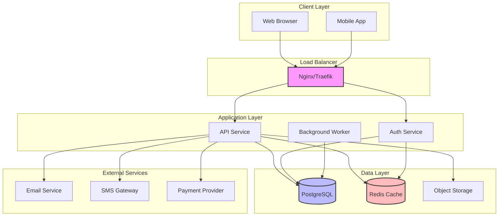
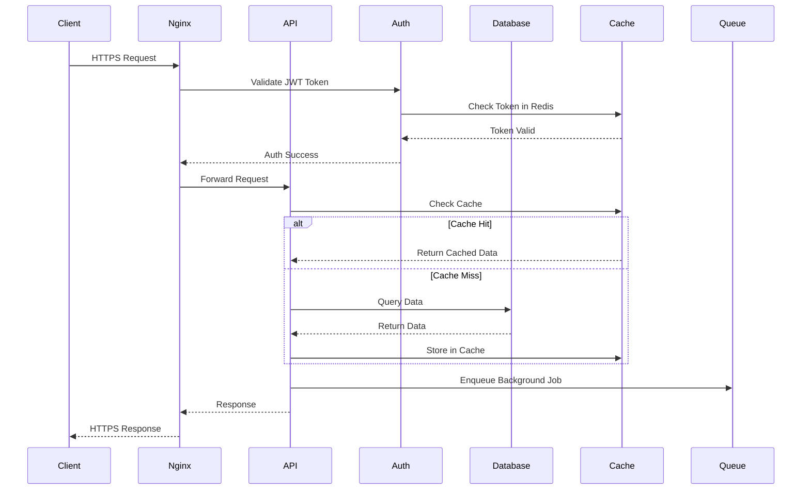
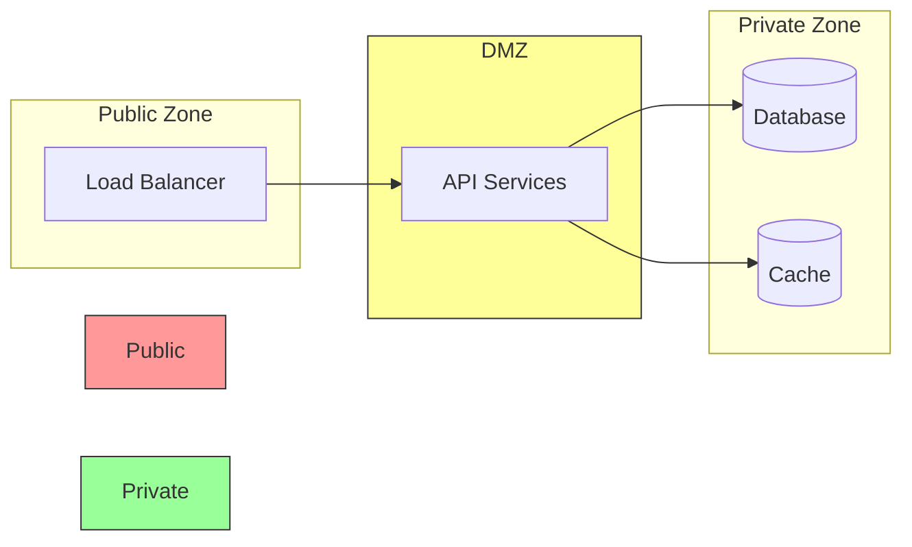

# ARCHITECTURE 系統架構

## System Overview (系統概覽)

## Service List (服務清單)

| Service Name | Port (Internal/External) | Purpose | Dependencies | Health Check Endpoint |
|--------------|--------------------------|---------|--------------|----------------------|
| nginx | 80:80, 443:443 | Reverse proxy and load balancer | - | `/health` |
| api-service | 8080:8080 | Main REST API | PostgreSQL, Redis | `/api/health` |
| auth-service | 8081:8081 | Authentication & Authorization | PostgreSQL, Redis | `/auth/health` |
| worker-service | - | Background job processing | PostgreSQL, Redis | N/A (internal logs) |
| postgres | 5432:5432 | Primary database | - | `pg_isready` |
| redis | 6379:6379 | Cache and session store | - | `redis-cli ping` |
| backup-service | - | Automated backup scheduler | PostgreSQL | N/A (cron-based) |

## Infrastructure Requirements (基礎設施需求)

### Minimum System Requirements
- **CPU**: 4 cores (8 recommended for production)
- **RAM**: 8GB minimum (16GB recommended)
- **Disk**: 100GB SSD (NVMe preferred)
- **OS**: Ubuntu 22.04 LTS / RHEL 8+ / Debian 11+
- **Docker**: 24.0+ with Docker Compose v2.20+

### Network Architecture
- **Internal Network**: `172.20.0.0/16` (isolated Docker network)
- **Exposed Ports**: Only Nginx (80, 443) should be publicly accessible
- **Firewall**: UFW/iptables configured to block all except HTTP/HTTPS

## Third-Party API Dependencies (第三方 API 依賴)

| Provider | Service Type | Usage | API Endpoint | Rate Limit | Fallback Strategy |
|----------|--------------|-------|--------------|------------|-------------------|
| SendGrid | Email Delivery | Transactional emails | `https://api.sendgrid.com/v3` | 100 req/sec | Queue retry with exponential backoff |
| Twilio | SMS Gateway | OTP verification | `https://api.twilio.com/2010-04-01` | 1000 msg/sec | Alternative provider (Nexmo) |
| Stripe | Payment Processing | Subscription & payments | `https://api.stripe.com/v1` | 100 req/sec | Payment queue, manual reconciliation |
| AWS S3 | Object Storage | File uploads/downloads | `https://s3.amazonaws.com` | 5500 req/sec | MinIO as self-hosted fallback |
| Google Maps API | Geolocation | Address validation | `https://maps.googleapis.com/maps/api` | 50 req/sec | Cache results, manual entry fallback |

## Data Flow Diagram (資料流程圖)

## Security Architecture (安全架構)

### Authentication Flow
- **Method**: JWT with refresh token rotation
- **Token Lifetime**: Access (15 min), Refresh (7 days)
- **Storage**: HttpOnly cookies (production), localStorage (dev only)

### Data Encryption
- **In Transit**: TLS 1.3 only (enforced by Nginx)
- **At Rest**: PostgreSQL encryption with pgcrypto
- **Secrets**: Stored in Docker secrets / Vault (production)

### Network Segmentation

## Disaster Recovery Architecture (災難恢復架構)

| Component | Backup Frequency | Retention | Recovery Time Objective (RTO) | Recovery Point Objective (RPO) |
|-----------|------------------|-----------|-------------------------------|--------------------------------|
| PostgreSQL | Every 6 hours | 30 days | < 30 minutes | < 6 hours |
| Redis | Daily snapshot | 7 days | < 5 minutes | < 24 hours |
| File Storage | Continuous (S3 versioning) | 90 days | < 1 minute | Near real-time |
| Configuration | On every change (Git) | Forever | < 5 minutes | Zero data loss |

## Monitoring & Observability (監控與可觀測性)

### Metrics Collection
- **Tool**: Prometheus + Grafana
- **Retention**: 15 days (metrics), 30 days (logs)
- **Endpoints**: All services expose `/metrics` in Prometheus format

### Alerting Thresholds
| Metric | Warning | Critical | Action |
|--------|---------|----------|--------|
| CPU Usage | > 70% | > 90% | Auto-scale or manual intervention |
| Memory Usage | > 75% | > 90% | Check for memory leaks |
| Disk Usage | > 80% | > 95% | Expand volume or cleanup |
| API Response Time | > 500ms | > 2s | Investigate slow queries |
| Error Rate | > 1% | > 5% | Incident response triggered |

---

**Document Version**: 1.0  
**Last Updated**: 2026-02-02  
**Maintained By**: Infrastructure Team  
**Review Cycle**: Quarterly or after major changes
